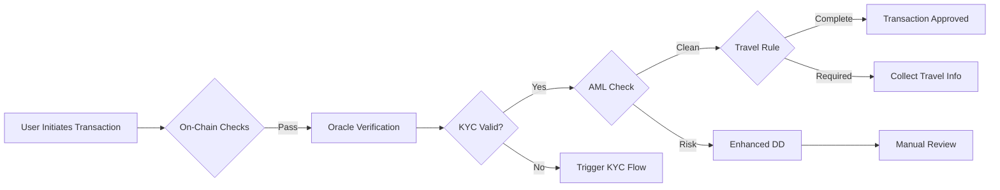

# Shor Compliance Framework - Future Vision

## 🚀 Comprehensive Compliance Ecosystem

### Overview

The Shor Compliance Framework is designed to evolve into a comprehensive, modular ecosystem that bridges the gap between traditional compliance requirements and blockchain technology. This document outlines our vision for extending the framework to handle the full spectrum of regulatory compliance needs.

## 📊 Multi-Provider Architecture

### Current State (v1.0)
```
┌─────────────┐
│   Sumsub    │ → Basic KYC/AML
└─────────────┘
```

### Future State (v2.0+)
```
┌─────────────────────────────────────────────┐
│          Shor Compliance Framework          │
├─────────────┬─────────────┬────────────────┤
│    KYC      │     AML     │  Travel Rule   │
├─────────────┼─────────────┼────────────────┤
│ • Sumsub    │ • Chainalysis│ • Notabene    │
│ • Onfido    │ • Elliptic   │ • Sygna       │
│ • Jumio     │ • CipherTrace│ • OpenVASP    │
│ • Persona   │ • TRM Labs   │               │
└─────────────┴─────────────┴────────────────┘
```

## 🔮 Enhanced Smart Contract Architecture

### Next-Generation Guardrail Contract

```solidity
contract EnhancedGuardrail {
    // Multi-dimensional compliance tracking
    struct ComplianceStatus {
        // Identity Verification
        bool kycVerified;
        string kycProvider;
        uint256 kycExpiry;
        
        // AML Risk Assessment
        uint8 amlRiskScore;      // 0-100
        bool sanctionsClean;
        uint256 lastAmlCheck;
        
        // Enhanced Due Diligence
        bool pep;               // Politically Exposed Person
        bool adverseMedia;      // Negative news
        string sourceOfFunds;   // Verified source
        
        // Jurisdiction & Accreditation
        string jurisdiction;
        bool accredited;
        string accreditationType;
        
        // Travel Rule Compliance
        bool travelRuleCompliant;
        bytes32 vaspId;
    }
    
    // Multi-oracle system for different providers
    mapping(string => address) public oracles;
    mapping(address => ComplianceStatus) public compliance;
    
    // Configurable compliance rules per jurisdiction
    mapping(string => ComplianceRules) public jurisdictionRules;
}
```

## 🌐 Comprehensive Provider Integration

### 1. **Identity Verification (KYC)**
- **Sumsub**: Global KYC with liveness detection
- **Onfido**: AI-powered identity verification
- **Jumio**: Document verification specialist
- **Persona**: Customizable verification flows

### 2. **AML & Blockchain Analytics**
- **Chainalysis**: Industry-leading blockchain analytics
- **Elliptic**: Crypto compliance and investigations
- **CipherTrace**: Cryptocurrency intelligence
- **TRM Labs**: Real-time risk detection
- **Merkle Science**: Predictive risk intelligence

### 3. **Sanctions & PEP Screening**
- **Refinitiv World-Check**: Comprehensive sanctions database
- **Dow Jones**: Risk & compliance data
- **ComplyAdvantage**: Real-time sanctions monitoring
- **LexisNexis**: Global risk screening

### 4. **Travel Rule Compliance**
- **Notabene**: FATF Travel Rule solution
- **Sygna Bridge**: VASP-to-VASP communication
- **OpenVASP**: Open-source messaging protocol
- **CipherTrace Traveler**: Travel Rule compliance

### 5. **Transaction Monitoring**
- **Actimize**: Pattern-based monitoring
- **NICE Actimize**: AI-driven detection
- **Feedzai**: Machine learning risk prevention

## 📋 Enhanced Compliance Modules

### Future compliance.yaml Structure

```yaml
version: "2.0"
metadata:
  project_name: "Global DeFi Platform"
  jurisdiction: "Multi-jurisdictional"
  
modules:
  # Basic compliance (current)
  token_sale:
    max_cap_usd: 100000000
    kyc_threshold_usd: 0
    
  # Enhanced KYC/AML (future)
  identity_verification:
    providers:
      primary: "sumsub"
      fallback: "onfido"
    requirements:
      - government_id
      - proof_of_address
      - liveness_check
      - biometric_verification
    expiry_days: 365
    
  aml_screening:
    providers:
      blockchain: "chainalysis"
      sanctions: "refinitiv"
    rules:
      max_risk_score: 75
      rescan_frequency_days: 30
      high_risk_jurisdictions: ["KP", "IR", "MM"]
      mixer_tolerance: 0.1  # 10% indirect exposure
      
  enhanced_due_diligence:
    triggers:
      - amount_usd: 100000
      - pep_status: true
      - high_risk_jurisdiction: true
    requirements:
      - source_of_funds_documentation
      - wealth_verification
      - enhanced_background_check
      
  travel_rule:
    provider: "notabene"
    threshold_usd: 1000
    required_fields:
      - originator_name
      - originator_account
      - beneficiary_name
      - beneficiary_account
      
  transaction_monitoring:
    provider: "actimize"
    rules:
      - velocity_checks
      - pattern_recognition
      - cross_chain_analysis
    alert_thresholds:
      daily_volume_usd: 1000000
      transaction_count: 100
      unique_addresses: 50
      
  regulatory_reporting:
    jurisdictions:
      US:
        - form_8300  # Cash transactions > $10k
        - sar_filing  # Suspicious activity
        - ctr_filing  # Currency transaction reports
      EU:
        - amld5_reporting
        - mica_disclosures
      SG:
        - ps_act_returns
        - mas_reporting
```

## 🔄 Hybrid Compliance Workflows

### Real-Time Compliance Check Flow



## 🏗️ Implementation Roadmap

### Phase 1: Foundation (Current)
- ✅ Basic KYC integration (Sumsub)
- ✅ Simple on-chain verification
- ✅ Jurisdiction templates
- ✅ Policy generation

### Phase 2: Multi-Provider Support
- [ ] Provider plugin system
- [ ] Multiple KYC providers
- [ ] Basic AML integration
- [ ] Enhanced smart contracts

### Phase 3: Comprehensive AML 
- [ ] Blockchain analytics integration
- [ ] Real-time risk scoring
- [ ] Sanctions screening
- [ ] PEP database integration

### Phase 4: Travel Rule & Reporting
- [ ] Travel Rule protocol integration
- [ ] Automated regulatory reporting
- [ ] Cross-chain compliance
- [ ] VASP certification support

### Phase 5: AI-Powered Compliance
- [ ] ML-based risk assessment
- [ ] Predictive compliance
- [ ] Automated suspicious activity detection
- [ ] Natural language policy generation

## 💡 Advanced Features Vision

### 1. **Compliance-as-a-Service API with 402 Payment Model**

#### Pay-Per-Check Compliance Model
```typescript
// Future API endpoints with 402 Payment Required
POST   /api/v2/compliance/comprehensive-check  // 402: Payment Required
GET    /api/v2/compliance/status/:address      // Free (cached results)

// KYC/Identity Verification
POST   /api/v2/compliance/kyc/verify          // 402: Payment Required
POST   /api/v2/compliance/kyc/liveness-check  // 402: Payment Required
GET    /api/v2/compliance/kyc/status/:userId  // Free (cached results)

// AML & Sanctions
POST   /api/v2/compliance/aml/screen          // 402: Payment Required
POST   /api/v2/compliance/sanctions/check     // 402: Payment Required
POST   /api/v2/compliance/pep/screen          // 402: Payment Required
GET    /api/v2/compliance/risk-score/:address // 402: Payment Required

// Blockchain Analytics
POST   /api/v2/compliance/blockchain/analyze   // 402: Payment Required
POST   /api/v2/compliance/mixer-detection     // 402: Payment Required
POST   /api/v2/compliance/source-of-funds     // 402: Payment Required

// Travel Rule
POST   /api/v2/compliance/travel-rule/initiate // 402: Payment Required
POST   /api/v2/compliance/travel-rule/verify   // 402: Payment Required
GET    /api/v2/compliance/vasp/lookup/:vaspId  // Free

// Enhanced Due Diligence
POST   /api/v2/compliance/edd/request         // 402: Payment Required
POST   /api/v2/compliance/adverse-media/scan  // 402: Payment Required
POST   /api/v2/compliance/wealth-verification // 402: Payment Required

// Accreditation & Jurisdiction
POST   /api/v2/compliance/accreditation/verify // 402: Payment Required
POST   /api/v2/compliance/jurisdiction/check   // 402: Payment Required
GET    /api/v2/compliance/rules/:jurisdiction  // Free

// Reporting & Monitoring
POST   /api/v2/compliance/transaction/monitor  // 402: Payment Required
POST   /api/v2/compliance/sar/generate        // 402: Payment Required
POST   /api/v2/compliance/ctr/file            // 402: Payment Required
```

#### Payment Flow Implementation
```typescript
// 402 Payment Required Response
{
  "error": "Payment Required",
  "status": 402,
  "payment": {
    "accepted_methods": [
      {
        "type": "lightning",
        "invoice": "lnbc..."
      },
      {
        "type": "crypto",
        "addresses": {
          "ETH": "0x...",
          "USDC": "0x...",
          "BTC": "bc1q..."
        }
      },
      {
        "type": "stripe",
        "session_url": "https://checkout.stripe.com/..."
      }
    ],
    "receipt_callback": "/api/v2/payment/confirm",
    "expires_at": "2025-01-01T00:05:00Z"
  }
}

// After payment, receive access token
{
  "access_token": "comp_check_abc123...",
  "expires_in": 300,
  "check_url": "/api/v2/compliance/comprehensive-check/abc123"
}
```

#### Provider Cost Distribution
```typescript
class CompliancePaymentRouter {
  // Route payments to providers based on usage
  async distributePayment(
    checkType: string,
    payment: Payment,
    providersUsed: string[]
  ) {
    const distribution = {
      'kyc': { 'sumsub': 0.30, 'onfido': 0.35 },
      'aml': { 'chainalysis': 0.40, 'elliptic': 0.45 },
      'sanctions': { 'refinitiv': 0.20 },
      'platform_fee': 0.15  // Shor protocol fee
    };
    
    // Smart contract distributes payments
    await this.paymentSplitter.distribute(
      payment.amount,
      distribution,
      providersUsed
    );
  }
}
```

#### On-Chain Payment Settlement
```solidity
contract CompliancePaymentManager {
    // Provider registry with payment addresses
    mapping(string => ProviderPayment) public providers;
    
    struct ProviderPayment {
        address paymentAddress;
        uint256 feePerCheck;
        uint256 totalEarned;
        uint256 pendingWithdrawal;
    }
    
    // User prepays for checks
    mapping(address => uint256) public userCredits;
    
    // 402 payment handler
    function payForCheck(
        string calldata checkType,
        string[] calldata providers
    ) external payable returns (bytes32 accessToken) {
        uint256 totalCost = calculateCost(checkType, providers);
        require(msg.value >= totalCost, "Insufficient payment");
        
        // Generate access token
        accessToken = keccak256(
            abi.encodePacked(msg.sender, checkType, block.timestamp)
        );
        
        // Distribute to providers
        distributePayments(checkType, providers, msg.value);
        
        emit CheckPurchased(msg.sender, checkType, accessToken);
    }
    
    // Bulk purchase credits
    function purchaseCredits() external payable {
        userCredits[msg.sender] += msg.value;
        emit CreditsPurchased(msg.sender, msg.value);
    }
}
```

#### Developer Experience
```typescript
// SDK handles 402 transparently
const compliance = new ShorCompliance({
  payment: {
    method: 'credits',  // or 'pay-per-use'
    wallet: userWallet,
    autoTopUp: true,
    minBalance: 50
  }
});

try {
  // SDK automatically handles 402 payment
  const result = await compliance.checkComprehensive(address);
} catch (error) {
  if (error.code === 'INSUFFICIENT_CREDITS') {
    // Prompt user to top up
    await compliance.purchaseCredits(100);
    // Retry
  }
}
```

### 2. **Cross-Chain Compliance Bridge**
```solidity
// Share compliance status across blockchains
interface IComplianceBridge {
    function syncCompliance(address user, uint256 targetChain) external;
    function queryCompliance(address user, uint256 sourceChain) external view;
}
```

### 3. **Decentralized Compliance Network**
- Consortium of compliance oracles
- Consensus-based verification
- Privacy-preserving compliance proofs
- Cross-jurisdictional recognition

### 4. **Zero-Knowledge Compliance Proofs**
```solidity
// Prove compliance without revealing details
contract ZKCompliance {
    function verifyCompliance(
        bytes32 commitment,
        bytes calldata proof
    ) external view returns (bool) {
        // Verify ZK proof of compliance
        return zkVerifier.verify(commitment, proof);
    }
}
```

## 🌍 Global Compliance Coverage

### Supported Jurisdictions (Future)
- **Americas**: US, CA, BR, MX, AR
- **Europe**: EU (27 countries), UK, CH, NO
- **Asia-Pacific**: SG, JP, KR, AU, NZ, HK
- **Middle East**: UAE, SA, IL
- **Africa**: ZA, NG, KE

### Regulatory Frameworks (Future)
- SEC (Securities)
- CFTC (Commodities)
- FinCEN (AML)
- MiCA (EU Crypto)
- MAS (Singapore)
- FSA (Japan)
- FCA (UK)
- AUSTRAC (Australia)

## 🔐 Privacy & Security Enhancements

### Data Minimization
- Store only verification proofs on-chain
- Use IPFS for encrypted document storage
- Implement right-to-erasure compliance

### Multi-Party Computation
- Distributed KYC verification
- No single point of failure
- Privacy-preserving analytics

## 🚦 Success Metrics

### Technical Goals
- Sub-second compliance checks
- 99.9% uptime for oracles
- Support for 50+ providers
- 100+ jurisdiction templates

### Business Goals
- Reduce compliance costs by 80%
- Accelerate onboarding from days to minutes
- Enable compliant DeFi at scale
- $1T+ in compliant transaction volume

## 🤝 Ecosystem Partnerships

### Strategic Integrations
- **DeFi Protocols**: Aave, Compound, Uniswap
- **CEXs**: For fiat on/off ramps
- **Traditional Finance**: Banks, brokerages
- **Regulators**: Sandbox participation

### Developer Ecosystem
- Plugin marketplace
- Bounty programs
- Compliance hackathons
- Open-source contributions

*"Making compliance as easy as `npm install @shor/compliance`"*